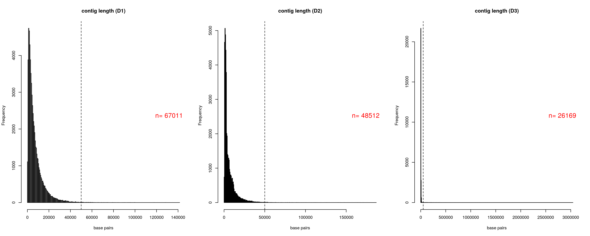
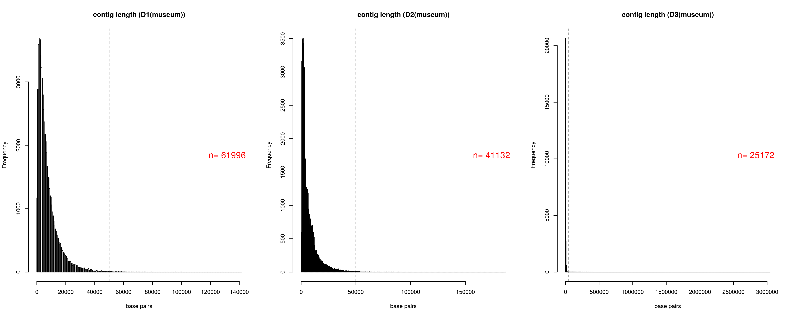
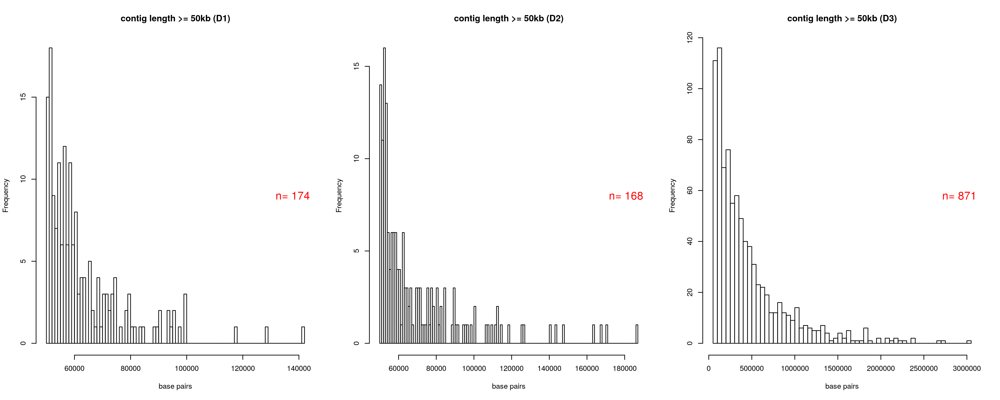
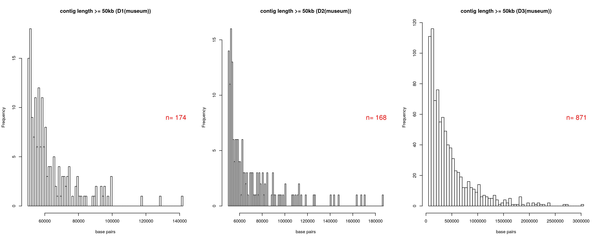
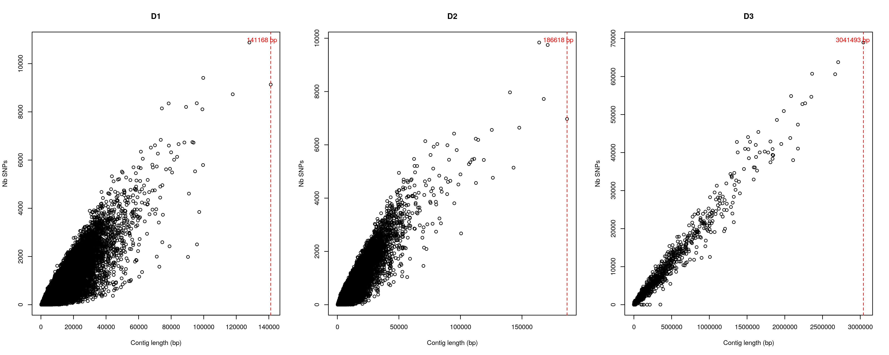
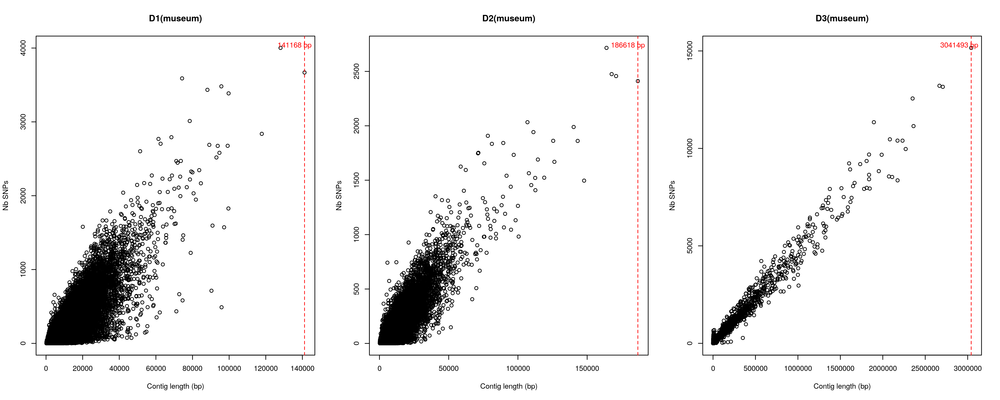

# Triplet D: some initial checks

 

## Contig length histogram (just for contigs with variants)

*Modern data*

*Museum data*

**Note:** Dashed line corresponds to contig length = 50 kb and *n* is the total number of contigs that have variants after the variant filtering.

 

## Contig length histogram (zoom in for contigs larger than 50kb)

*Modern data*

*Museum data*

**Note:** *n* is the total number of contigs larger than 50kb that have variants after the variant filtering. Similar histograms for both museum and and modern samples, but as we can see below the number of snps per contig is going to be different.  
 
  

## Comparison between genome assembly and population data for the number of scaffolds >50 kb 

Species | Genome Assembly | Population data (after variant filtering)
------------ | ------------- |---------
D1 | 184 | 174
D2 | 211 | 168
D3 | 889 | 871

 

## Plotting number of SNPs per contig length 

*Modern data*

*Museum data*

**Note:** Red dashed line corresponds to the length of the largest contig.

 

>
-----------------------------------------
__*FINAL NOTE:*__

The D triplet appears to be working fine.

