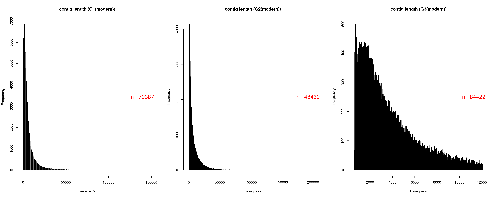
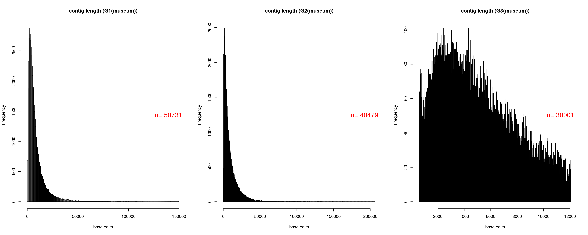
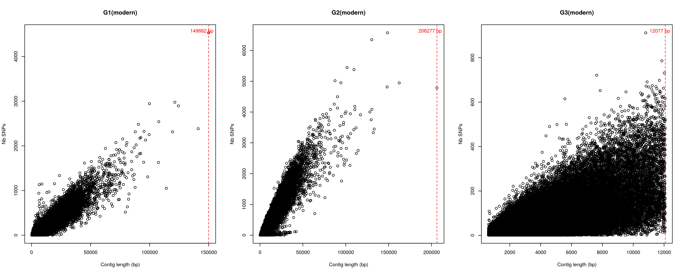
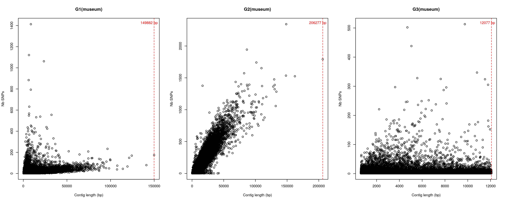

# Triplet G: some initial checks

 

 

## Contig length histogram (just for contigs with variants)

*Modern data*

*Museum data*

**NOTE:** Dashed line corresponds to contig length = 50 kb and *n* is the total number of contigs that have variants after the variant filtering.

 

## Plotting number of SNPs per contig length 

*Modern data*

*Museum data*

**NOTE:** Both modern and museum G3 don't show any variants in contigs larger than ~ 12 kb. Red dashed line corresponds to the length of the largest contig.

